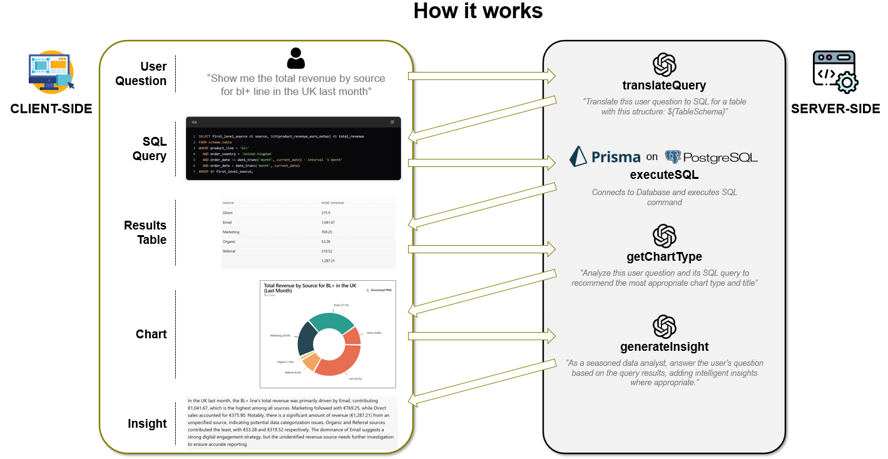
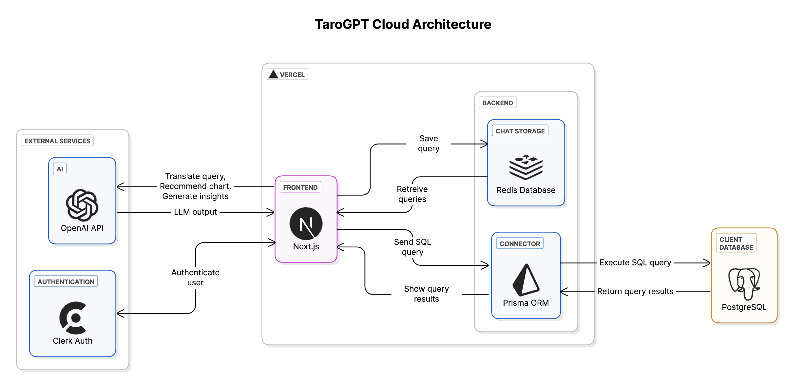

# TaroGPT - Smart Database Interface

  

TaroGPT is an intelligent natural language interface to PostgreSQL databases. It enables users to query databases using plain English, get visual representations of data, and receive AI-powered insights without writing any SQL code.

> **Disclaimer**: All data used in this application is fictional. Any resemblance to real companies, products, or actual data is purely coincidental and unintentional.

**✨ Try it out: [tarohq.dev](https://tarohq.dev) - Sign up for free and start exploring the data!**

## 🌟 Core Functionality

The main feature of TaroGPT is its **Q&A interface** that allows you to:

1. Ask questions about your data in plain English
2. Get instant SQL translations of your questions
3. View query results in clean, organized tables
4. Receive automatically generated data visualizations
5. Get AI-powered insights about your data

  
  
<em>How TaroGPT transforms natural language into insights</em>

The **Data Analysis Agent** (currently in beta) provides an enhanced experience with multi-step reasoning and more comprehensive analysis capabilities.

## 🛠️ Tech Stack

- **Frontend**: Next.js 14 with App Router, React, TypeScript
- **UI Components**: Shadcn UI, Radix UI, and Tailwind CSS
- **AI Models**: OpenAI GPT-4o for natural language processing
- **Database**: PostgreSQL with Prisma ORM
- **Chat History**: Redis KV for chat history
- **Agent Framework**: LangGraph for creating an advanced data analysis workflow
- **Authentication**: Clerk for secure user management

  
  
<em>TaroGPT's cloud architecture</em>

## 🚀 Setup & Deployment

### Quick Start

1. Clone the repository
2. Set up environment variables (see `.env.example`)
3. Run `yarn install` and `yarn dev`

### Vercel Deployment

1. Push to GitHub (sensitive files are gitignored)
2. Connect to Vercel and configure environment variables
3. Deploy