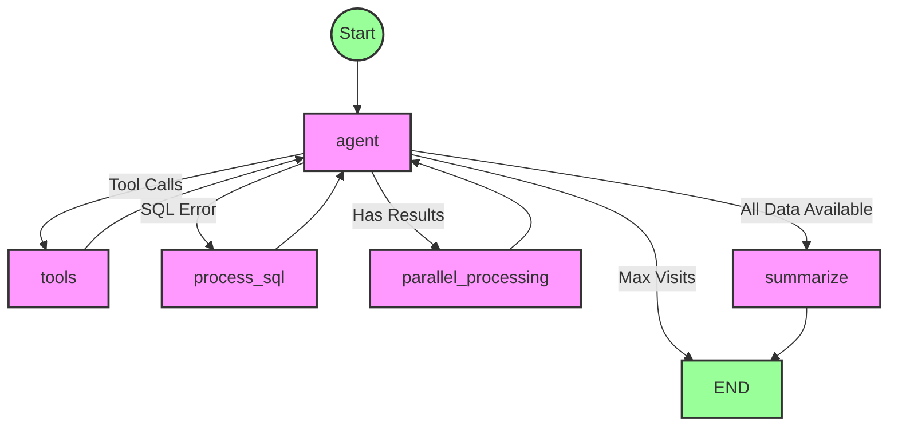

# Data Analyst Agent

This agent uses LangGraph to create a workflow that helps users analyze data by:

1. Translating natural language questions into SQL
2. Executing SQL queries against a database
3. Analyzing results and generating insights
4. Recommending appropriate visualizations
5. Providing comprehensive summaries

## Workflow Architecture

## Node Responsibilities

- **agent**: Main decision-making node that processes user input and decides next steps
- **tools**: Executes tools like SQL translation, query execution, chart recommendation, and insight generation
- **process_sql**: Handles SQL errors with retry logic (up to 3 retries)
- **parallel_processing**: Processes query results to generate insights and chart recommendations in parallel
- **analyze_results**: Generates insights from query results (alternative to parallel processing)
- **recommend_visualization**: Suggests appropriate chart types (alternative to parallel processing)
- **summarize**: Creates a final summary that answers the user's question

## State Management

The workflow maintains state across nodes including:

- Message history
- Current user question
- Generated SQL query
- Query results
- Chart recommendations
- Generated insights
- Node visit counts (for limiting iterations)
- SQL errors (for retry logic)
- Retry count

## Routing Logic

The workflow uses conditional routing to determine the next step based on:

1. Whether a tool needs to be called (translate_sql, execute_sql, etc.)
2. Whether SQL errors occurred and need retry
3. Whether results need visualization or analysis
4. Whether a final summary needs to be generated
5. Whether maximum node visits have been reached (safety limit)

This architecture allows for a flexible, multi-step analysis process that can adapt to different types of data questions while handling errors gracefully.
